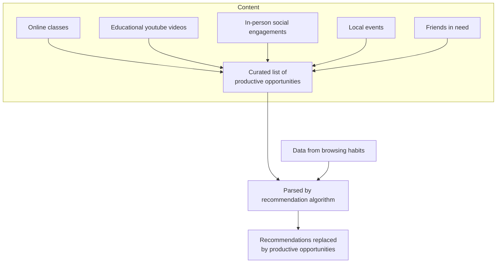

# Better Recommendations
Better Recommendations is an idea for a browser extension which asks the question, "What if your recommended content actually worked to make you a better person?" Using data collected about your interests and passions, Better Recommendations replaces your recommended content across the internet with resources to help you spend *less* time scrolling, or at least if you are, you're scrolling productively.

