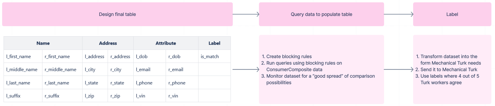

# Record Linkage: Labeled Record Comparison Dataset Design

## Introduction

To evaluate any record linkage model, it’s necessary to create a dataset of record comparisons, and whether each comparison is a True Match or a True Non-Match. After those are defined, we can use them to measure the output of a record linkage model on several different metrics. Assigning this “True Match?” flag (from here on, referred to as `is_match`) can be a tricky process, since the entire reason record linkage exists is **because** the truth is hard to evaluate. If it were so easy to tell the truth, we wouldn’t have to think of creative record linkage solutions! This document will outline the process used to create a Labeled Record Comparison Dataset, which can be used to evaluate the performance of your record linkage solutions.

## Process Overview

Creating the labeled record comparison dataset involves three steps, and you have some flexibility in each step to customize the process in your implementation.

1. Design final comparison table
2. Query data and populate comparison table
3. Label data

## Design final table

This is a labeled record **comparison** dataset, so your table has to be structured in such a way that each row is a comparison (not a person!). What columns you use in this comparison are completely up to you and the requirements of your implementation. 

The end result is a table of record comparisons, which you can think of like this. Remember, all of the data in the below table would be **a single row** in your comparisons dataset, with columns like `l_first_name`, `r_first_name`, `l_middle_name`, `r_middle_name`, etc.

| Variable     | Left record           | Right record      |
|--------------|-----------------------|-------------------|
| first_name   | Justin                | Justin            |
| middle_name  |                       |                   |
| last_name    | Macak                 | Macak             |
| suffix       |                       |                   |
| address      | 123 Main St           | 24 Oak St         |
| city         | Springfield           | Beverly Hills     |
| state        | IL                    | CA                |
| zip          | 62536                 | 90210             |
| dob          |                       | 1/1/1970          |
| email        | justin.macak@gmail.com| justin.macak@gmail.com|
| phone        | 555-555-5555          |                   |
| vin          |                       |                   |

## Query data to populate table

Now that you have an empty table, you have to populate it with the right data. Your data should:

- Be representative of the data you want your model to match
- Include a healthy mix of true matches and true non-matches

This can be a lot trickier than it sounds! If you don’t know whether records are truly matching or non-matching, *how are you supposed to query for it?* Out of 500 million rows, how do you pick out 2 rows that have “a decent chance, but not a 100% chance” of being a match? Your solution to this problem is part of where your implementation differentiates itself from other implementations.

> Here’s a possible solution:
>
> Using the same idea behind blocking rules, we can narrow down the comparison possibilities and increase the likelihood of two records matching. At the same time, with only the blocked columns being locked, the rest of the columns are free to be representative of the data we want to match.
>
> Blocking rules you could use:
>
> - first name & address
> - last name & address
> - first name & last name
> - email
> - phone
>
> It’s important to make sure to strike a balance between the number of rows each column is locked due to a blocking rule. For example, if you use 10 records from the `first name & address` rule and 1000 records from the `email` rule, only 1% of your comparisons will not match on email, because you defined 1000 of your 1010 records as "matching on email." This is going to affect how your record linkage solution assigns probabilities to each column. Note that the first two rules above are both going to lock the `address` column!
>
> Additionally, make sure your queries have a clause where **at least one** of the non-blocked columns must be different. If there’s a 100% match between all columns, there’s no mystery; it’s obviously a match.

## Label data

This is arguably the easiest step; all you need to do is find some way to label the comparisons, and most of the time, that involves getting a human to look at them. All this means is that they look at the two records being compared in the row, and then set `is_match` to 1 if it's a match, and 0 if it's not. So the question is simply, how will you do this affordably, reliably, and at scale? 

> Possible solutions:
> - Label Your Data
> - Clickworker
> - Amazon Mechanical Turk (careful with this one, as labeling PII data is against their terms of service!)
> - And many more; just search for "data labeling service" and you'll see what I mean
> In addition, feel free to get creative here! Maybe you want to distribute the workload, [like Captcha did](https://www.techradar.com/news/captcha-if-you-can-how-youve-been-training-ai-for-years-without-realising-it)? Maybe you're looking for a brutal introduction to the world of AI for the students in your classroom? Maybe you have a babysitting gig on Friday, and you're considering the profit margins of enlisting the help of a couple of toddlers... After all, this is the world of AI! What's a little "ethical gray" in the name of progress?

## Conclusion

We need a labeled dataset to evaluate the performance of our record linkage solutions. We can create this dataset by using “blocking rules” to create queries that result in a good mix of true matches and true non-matches. In our example, the final table will have the following 25 columns; note that there are Left and Right versions of each variable, and then a single “is_match” boolean flag for the entire Left vs Right comparison.

| L_Name | R_Name | L_Address | R_Address | L_Attribute | R_Attribute | Label |
|--------|--------|-----------|-----------|-------------|-------------|-------|
l_first_name | r_first_name | l_address | r_address | l_dob | r_dob | is_match
l_middle_name | r_middle_name | l_city | r_city | l_email | r_email | |
l_last_name | r_last_name | l_state | r_state | l_phone | r_phone | |
l_suffix | r_suffix | l_zip | r_zip | l_vin | r_vin | |