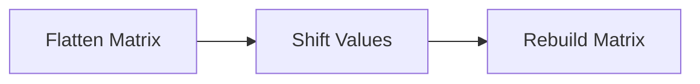
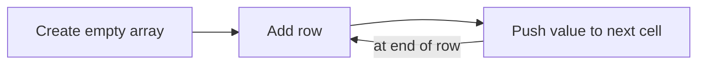

# The problem

> Given a 2D grid of size `m x n` and an integer `k`. You need to shift the grid `k` times.
>
> In one shift operation:
>
> - Element at `grid[i][j]` moves to `grid[i][j + 1]`.
> - Element at `grid[i][n - 1]` moves to `grid[i + 1][0]`.
> - Element at `grid[m - 1][n - 1]` moves to `grid[0][0]`.
>
> Return the 2D grid after applying shift operation k times.
>
> Example 1:
>
> 
>
> Input: `grid = [[1,2,3],[4,5,6],[7,8,9]], k = 1`
>
> Output: `[[9,1,2],[3,4,5],[6,7,8]]`

# Planning a solution
While I conceptually understand the indexing they are referencing in the "In one shift operation:" section, this is one of those times where there is simply no replacement for the provided image. The objective is to push the values "through" the matrix, and when the values fall off the edge, they should wrap around to the beginning.

Helpful functions that spring to mind might be the `flat()`, `pop()`, and `unshift()` functions in JavaScript, so I'll code this solution in JavaScript. I'm sure there's an equivalent function in Python, but I need to work on my JavaScript, anyway. Here's my initial plan:



# Coding Solution
## Flatten Matrix

This was pretty straightforward; `flat()` did all the heavy lifting for us.
```javascript
/**
 * @param {number[][]} grid
 * @param {number} k
 * @return {number[][]}
 */
var shiftGrid = function(grid, k) {

    // flatten matrix
    var flattened = grid.flat();

    console.log(flattened);
}
```

```
Input:  [[1,2,3],[4,5,6],[7,8,9]] 1
stdout: [1, 2, 3, 4, 5, 6, 7, 8, 9]
```

Success! Now to make our shift.

## Shift Values
The idea here is to use `pop()` to return the value from the *end* that we want to shift, then put it back at the *beginning* by using `unshift()`. If that works, we just loop through that process `k` times.

```javascript
var shiftGrid = function(grid, k) {
    
    // Flatten matrix
    var flattened = grid.flat();
    
    // Shift values
    for (i=0;i<k;i++){
        var pusher = flattened.pop();
        flattened.unshift(pusher);
    }
    
    console.log(flattened);
}
```

```
Input:  [[1,2,3],[4,5,6],[7,8,9]] 1
stdout: [9, 1, 2, 3, 4, 5, 6, 7, 8]
```

It works! I'm not a huge fan of the name I gave to `pusher`, mostly because the `push()` method adds elements to the *end* of the array instead of the *beginning*. Maybe I should have named it `unshifter`. In a similar vein, since these methods are updating the `flattened` array, after the shifting it's still named `flattened`, which gives me pause. Ideally, I would like to put in a line like `var shifted = flattened` and then do the shift operations on `shifted`, but it would come at the cost of speed and memory, so I left it out.

## Rebuild Matrix

This might be the trickiest part of the problem. The difficulty here is in declaring a two-dimensional array in JavaScript, then referencing the indices of that array in a `for` loop. I spent a long time looking for a clean and fast way to push elements to a 2D array, before settling on a solution that involved creating an empty array and using `push()` in a `for` loop to add elements one at a time.



```javascript
var shiftGrid = function(grid, k) {
    var shifted = [];
    
    // Flatten matrix
    var flattened = grid.flat();
    
    // Shift values
    for (i=0;i<k;i++){
        var pusher = flattened.pop();
        flattened.unshift(pusher);
    }
    
    // Rebuild matrix
    for (i=0;i<grid.length;i++) {
        shifted.push([]);
        for (j=0;j<grid[0].length;j++) {
            shifted[i].push(flattened[i+j]);
        }
    }
    
    console.log(shifted);
}
```

```
Input:   [[1,2,3],[4,5,6],[7,8,9]] 1
stdout:  [ [ 9, 1, 2 ], [ 1, 2, 3 ], [ 2, 3, 4 ] ]
```

Wrong output! I could tell from the repeating `[1, 2, 3]` that there was probably an indexing problem, so I set up some `console.log()` outputs to keep an eye on the values for `i` and `j`, and found what probably should have been obvious: when a new row is added, `i` gets reset to 0, so the index referencing the element in `flattened` is not continuing to increase as I was expecting. No problem, I just added a `counter` variable and put a `counter++` at the end of the innermost `for` loop.

We're in the home stretch; adding the counter got me the output I needed. After a few other test examples, I tried to submit my code, but ran into a problem with this test case:

```
Input:    [[1],[2],[3],[4],[5]] 1
Output:   [[6,5,1,2,3,4,7]]
Expected: [[6],[5],[1],[2],[3],[4],[7]]
```

The immediately apparent thing about this input is that it is a very tall matrix; it's only 1 column with 5 rows. My initial thought was that it had something to do with the `push()` command not looping correctly, and everything accidentally ending up in the same row, but after some debugging found that that wasn't the case. 

Instead, the other new feature of this matrix is that it is *not a square*. I honestly thought one of the example test cases wouldn't have been a square, but they all were. After seeing that, I realized that the problem was in how I was referencing each index. Up to this point, I thought the length of a 2D array was the number of *columns*, and when I was referencing `shifted[i].length`, I was referencing the length of that column, i.e. the number of rows in the array. (An assumption I made based on my experience with Pandas!) But a 2D array is an array of arrays, so it would make sense that `shifted.length` would reference the number of rows, and `shifted[i].length` would reference the number of items in each row, i.e. the number of columns.

Fortunately, that's an easy fix; just swap the references to `grid.length` and `grid[0].length`, and everything works. 

```javascript
/**
 * @param {number[][]} grid
 * @param {number} k
 * @return {number[][]}
 */
var shiftGrid = function(grid, k) {
    var shifted = [];
    var flattened = grid.flat();
    
    for (i=0;i<k;i++){
        var pusher = flattened.pop();
        flattened.unshift(pusher);
    }
    
    var counter = 0;
    for (i=0;i<grid.length;i++) {
        shifted.push([]);
        for (j=0;j<grid[0].length;j++) {
            shifted[i].push(flattened[counter]);
            counter++;
        }
    }

    return shifted;
};
```

Runtime: 120 ms, >61.04% of submissions

Memory Usage: 48.5 MB, >36.36% of submissions