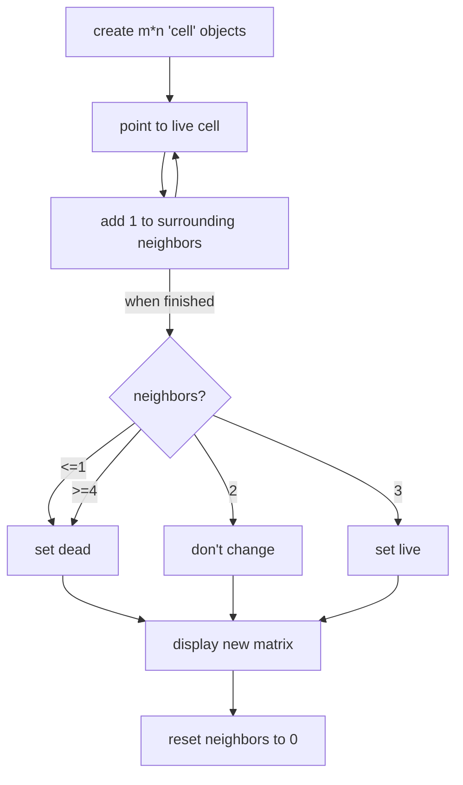

# The Problem

> According to Wikipedia's article: "The Game of Life, also known simply as Life, is a cellular automaton devised by the British mathematician John Horton Conway in 1970."
>
> The board is made up of an `m x n` grid of cells, where each cell has an initial state: **live** (represented by a `1`) or **dead** (represented by a `0`). Each cell interacts with its eight neighbors (horizontal, vertical, diagonal) using the following four rules (taken from the above Wikipedia article):
>
> 1. Any live cell with fewer than two live neighbors dies as if caused by under-population.
> 2. Any live cell with two or three live neighbors lives on to the next generation.
> 3. Any live cell with more than three live neighbors dies, as if by over-population.
> 4. Any dead cell with exactly three live neighbors becomes a live cell, as if by reproduction.
>
> The next state is created by applying the above rules simultaneously to every cell in the current state, where births and deaths occur simultaneously. Given the current state of the `m x n` grid `board`, return *the next* state.
>
> ### Example 1:
>
> 
>
> ```
> Input: board = [[0,1,0],[0,0,1],[1,1,1],[0,0,0]]
> Output: [[0,0,0],[1,0,1],[0,1,1],[0,1,0]]
> ```
>
> ### Example 2:
>
> 
>
> ```
> Input: board = [[1,1],[1,0]]
> Output: [[1,1],[1,1]]
> ```
> 
>
> ### Constraints:
>
>    - `m == board.length`
>    - `n == board[i].length`
>    - `1 <= m, n <= 25`
>    - `board[i][j]` is `0` or `1`.
>
> ### Follow up:
>
> - Could you solve it in-place? Remember that the board needs to be updated simultaneously: You cannot update some cells first and then use their updated values to update other cells.
> - In this question, we represent the board using a 2D array. In principle, the board is infinite, which would cause problems when the active area encroaches upon the border of the array (i.e., live cells reach the border). How would you address these problems?

# Planning a solution
It's always a pleasure to see the Game of Life play out, so I'm excited to solve a problem that has a key role in making the Game of Life happen. 

The heart of this problem is basically "code the rules into the system." Here's what I am expecting in terms of difficulty:
- Comparing the values is going to be trivial; it's just `neighbor == live`, etc. 
- Indexing the neighbors *can* provide a little bit of difficulty, but at the most basic level, I can just fall back on `cell[m][n]`, `cell[m-1][n-1]`, `cell[m-1][n]`, etc.
- Optimization will be difficult; each time you add a row to the grid, you are adding up to `8n` checks if you are simply looping through the neighbors. I'd like to find a solution that can aggregate further than that.
  - For fewer checks, maybe only check the cells with 1 in the initial state, and add 1 to all the cells around it
- I don't *foresee* the editing-in-place to be an issue, since my plan involves building a matrix and copying the values on to the first one, but that might be against the spirit of the problem.
  - It might come at the cost of memory, but you could make each cell an object with a `neighbors` attribute and add 1 to that attribute for each neighbor, then at the end of the code have a `go` function that would change all of the cells' `live` attributes.

Here's my plan:


# Coding the solution
I wrote yesterday's solution in JavaScript, so I'll write today's in Python. I imagine I'm going to be using dictionaries to store the data for each cell; I could create a class, but as far as I know, I won't be writing any functions that would take advantage of class behavior. I could theoretically put in functions like `cell.disperse()`, `cell.die()`, and `cell.birth()`, but that seems unnecessary in this case. Put it on the possible future feature list!

### Create `m*n` cell objects

```python
class Solution:
    def gameOfLife(self, board: List[List[int]]) -> None:
        """
        Do not return anything, modify board in-place instead.
        """
        
        cells = {}
        counter = 0
        for i in range(len(board)):
            for j in range(len(board[0])):
                cells[counter] = {
                    "x" : j,
                    "y" : i,
                    "live" : board[i][j]
                }
                counter += 1
        print(board)
        print(cells)
```

```
Input:  [[0,1,0],[0,0,1],[1,1,1],[0,0,0]]
stdout: [[0, 1, 0], [0, 0, 1], [1, 1, 1], [0, 0, 0]]
{0: {'x': 0, 'y': 0, 'live': 0}, 1: {'x': 1, 'y': 0, 'live': 1}, 2: {'x': 2, 'y': 0, 'live': 0}, 3: {'x': 0, 'y': 1, 'live': 0}, 4: {'x': 1, 'y': 1, 'live': 0}, 5: {'x': 2, 'y': 1, 'live': 1}, 6: {'x': 0, 'y': 2, 'live': 1}, 7: {'x': 1, 'y': 2, 'live': 1}, 8: {'x': 2, 'y': 2, 'live': 1}, 9: {'x': 0, 'y': 3, 'live': 0}, 10: {'x': 1, 'y': 3, 'live': 0}, 11: {'x': 2, 'y': 3, 'live': 0}}
```
It looks confusing, but the results are as expected: we have a set of items in a dictionary that have an `x` and `y` coordinate, as well as a `live` attribute. Since this dictionary is being created one entry at a time, future entries aren't available yet to update the `neighbors` value, so the current plan is to loop through the keys once the whole dictionary is created.

I'm not seeing the value (pun not intended) of using the `counter` variable for the keys, so I'd instead like the keys to be the `x` and `y` coordinates, and the values to be `live` and `neighbors`.

```python
        cells = {}
        for i in range(len(board)):
            for j in range(len(board[0])):
                cells[j, i] = {
                    "live" : board[i][j]
                }
        print(board)
        print(cells)
```

```
Input: [[0,1,0],[0,0,1],[1,1,1],[0,0,0]]
Output: [[0, 1, 0], [0, 0, 1], [1, 1, 1], [0, 0, 0]]
{(0, 0): {'live': 0}, (1, 0): {'live': 1}, (2, 0): {'live': 0}, (0, 1): {'live': 0}, (1, 1): {'live': 0}, (2, 1): {'live': 1}, (0, 2): {'live': 1}, (1, 2): {'live': 1}, (2, 2): {'live': 1}, (0, 3): {'live': 0}, (1, 3): {'live': 0}, (2, 3): {'live': 0}}
```
Much better!

### Point to cell, add 1 to neighbors
```python
# Create objects
cells = {}
for i in range(len(board)):
    for j in range(len(board[0])):
        cells[j, i] = {
            "live" : board[i][j],
            "neighbors" : 0
        }

# Disperse to neighbors
for key in cells.keys():
    if cells[key]['live'] == 1:
        x = key[0]
        y = key[1]
        transforms = [-1,0,1]
        neighbors = []
        for xtransform in transforms:
            for ytransform in transforms:
                neighbors.append((x+xtransform, y+ytransform))
        for neighbor in neighbors:
            if neighbor != key:
                if neighbor in cells:
                    cells[neighbor]['neighbors'] += 1
neighbor_table = []
for key in cells:
    neighbor_table.append(cells[key]['neighbors'])
print(neighbor_table)
```

```
Input:  [[0,1,0],[0,0,1],[1,1,1],[0,0,0]]
stdout: [1, 1, 2, 3, 5, 3, 1, 3, 2, 2, 3, 2]
```

This was the hard part! There was a lot of pencil and paper involved in making sure I was indexing the right cells and that the results were what they should be. But the output is there; `neighbor_table` contains accurate values for the number of neighbors for each cell. (it's not split into rows, but it's not actually going to be used in the final product)

The code itself in this section is not as clear as I would like it to be, and almost certainly not as fast. But at this stage in the game, I'm valuing readability over performance. I knew I would have to make sure I wasn't counting the current cell as a neighbor, and that I would have to be careful with border cells, but all of that just turned out to be a couple of easy `if` statements. 

Now to bring us home:

### Update life status, then display

```python
# Update life status
for key in cells.keys():
    neighbor_count = cells[key]['neighbors']
    if (neighbor_count <= 1) or (neighbor_count >= 4):
        cells[key]['alive'] = 0
    elif(neighbor_count == 3):
        cells[key]['alive'] = 1
    
    # Update matrix
    x = key[0]
    y = key[1]
    board[y][x] = cells[key]['alive']
    cells[key]['neighbors'] = 0
    
print(board)
```

```
Input: [[0,1,0],[0,0,1],[1,1,1],[0,0,0]]
stdout: [[0, 0, 0], [1, 0, 1], [0, 1, 1], [0, 1, 0]]
```

Wicked easy. Almost *criminally* easy. I am definitely learning about the power of planning ahead! Again, there are performance sacrifices made in the name of readability, but if optimization of the program became an issue, there are easy things to change, e.g. the `x`, `y`, and `neighbor_count` variable assignments. I'm pretty happy with the overall strategy, though. Optimization notes will follow after the Performance section.

### Performance
> Runtime: **56 ms**, faster than **28.61%** of Python3 online submissions for Game of Life.
>
> Memory Usage: **14 MB**, less than **51.25%** of Python3 online submissions for Game of Life.

### Optimization notes
- My solution loops through the entire grid three times! Any way I could take out at least one of these loops would be a huge benefit.
- As I mentioned a few times, there are several extra steps taken in my code simply to help readability. I personally value readability and maintenance much higher than performance, so I'm keeping them in, but removing these steps would increase performance.
- Every loop is a `for each` loop; an easy way to get a higher performance is to change these to `for` loops, using `m` and `n` as the upper bounds.

### Learning Points
- I definitely saw the power of planning before coding in this challenge. I've always appreciated the value of planning, but this was the first challenge where I wrote the entirety of the "Planning the solution" section before writing any code, and it paid off in spades when creating a neighbor strategy and an edit-in-place strategy.
- Because I was using tuple keys for my dictionary, I learned a lot about how the `dict.items()`, `dict.keys()`, and `dict.values()` methods work, and what values they return.
- The `in` keyword in `if neighbor in cells` was a godsend; it took a problem that I knew would be difficult (what to do about border cells) and made it completely trivial.