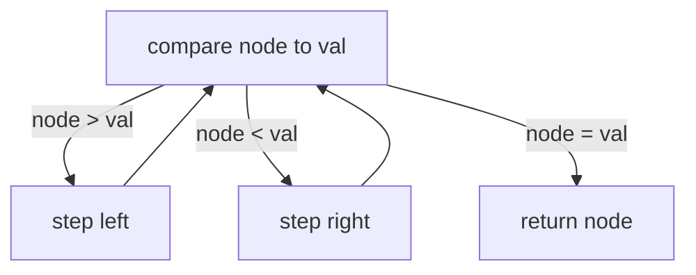

# The problem

> You are given the root of a binary search tree (BST) and an integer val.
> 
> Find the node in the BST that the node's value equals val and return the subtree rooted with that node. If such a node does not exist, return null.
> 
> **Example 1:**
>
> 
> 
> Input: root = [4,2,7,1,3], val = 2
> 
> Output: [2,1,3]
> 
> **Example 2:**
> 
> 
> 
> Input: root = [4,2,7,1,3], val = 5
> 
> Output: []
> 
> **Constraints:**
> 
> - The number of nodes in the tree is in the range `[1, 5000]`.
> - `1 <= Node.val <= 107`
> - `root` is a binary search tree.
> - `1 <= val <= 107`

# Planning a solution
I spent about 20 minutes researching binary search trees and typing out some functions to create one from a list before I realized that the list provided by LeetCode was only a list in appearance; it was actually a representation of an already-generated BST. Once I realized that, this problem became so trivial to solve that I solved it before I could even think of a plan. Here's the method, anyway:



# Coding the solution

```javascript
/**
 * Definition for a binary tree node.
 * function TreeNode(val, left, right) {
 *     this.val = (val===undefined ? 0 : val)
 *     this.left = (left===undefined ? null : left)
 *     this.right = (right===undefined ? null : right)
 * }
 */
/**
 * @param {TreeNode} root
 * @param {number} val
 * @return {TreeNode}
 */

var searchBST = function(root, val) {
    if (root == undefined) {
        return null;
    }
    if (root.val == val) {
        return root;
    }
    else if (root.val > val) {
        return searchBST(root.left, val);
    }
    else if (root.val < val) {
        return searchBST(root.right, val);
    }
};
```

There's not much to say here; it's an if/else block that mirrors the act of stepping through the BST.

# Performance

- Runtime: **74 ms**, faster than **95.33%** of JavaScript online submissions for Search in a Binary Search Tree.
- Memory Usage: **49.8 MB**, less than **15.23%** of JavaScript online submissions for Search in a Binary Search Tree.

# Optimization notes

- With so few lines of code, and with a 95.33% speed rating, it's difficult to think of an optimization strategy. Maybe there's some possibility of eliminating some of the recursion by thinking about the relationship between `val` and the values in the whole tree? Maybe there's a way to skip levels by comparing `val` to `root.left.val` or something?
- The memory usage leaves a lot more room for optimization. Most of the other submissions that have lower memory usage fell into two themes:
  1. Fewer lines of code (combining statements, usually), or
  2. Fewer returned trees.

  One 48.6 MB solution jumped out at me as being particularly elegant:
  ```javascript
  var searchBST = function(root, val) {
    while (root != null && root.val !== val) {
        root = val < root.val ? root.left : root.right 
    }
    return root
    }
    ```
    This solution came pretty close to being just a single line of code, and there's a lot of functionality packed into this `while` loop.

    - If `val` is the root of the whole tree, the function just passes the original `root` back after skipping the while loop.
    - If `val` exists in the tree, the `while` loop just keeps reassigning `root` to each node, until `root.val == val`, where it will exit the loop. No function is called during this process.
    - If `val` doesn't exist in the tree, the while loop will continue to run, but once it reaches a leaf of `root`, the next `root` assignment will be to `root.left` or `root.right`, which will be `null`, exiting the `while` loop and returning `null`.