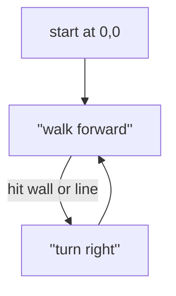

# The Problem

> Given a positive integer `n`, generate an `n x n` matrix filled with elements from `1` to `n^2` in spiral order.
>
> ## Example 1:
>
> 
> 
> **Input**: `n = 3`
>
> **Output**: `[[1,2,3],[8,9,4],[7,6,5]]`
>
> ## Example 2:
>
> **Input**: `n = 1`
> 
> **Output**: `[[1]]`
>
> ## Constraints:
> 
> - `1 <= n <= 20`

# Planning a solution

I'm a little wary about this problem, because initially it seems pretty easy. But the devil is in the details, so I wouldn't be surprised if during the course of this solution I hit some roadblock that proves to be a lot more difficult than I am expecting.

My first thought when it comes to this problem is that it's a turtle problem. If you had a remote-controlled turtle holding a pen, how would you draw a spiral? You would probably do something like this:
1. Start from a corner
2. Walk forward until you hit an edge or a previously-drawn line
3. Turn right
4. Repeat steps 2 & 3 until you can't anymore

I can't see any problems with this solution, as all of the matrices will be rectangles with no "obstacles" in them, so as long as I can figure out how to code "turn right" into indices, this should work well.



# Coding the solution

I could go either way for this challenge, python or JavaScript, so since I did yesterday's challenge in python, I'll write today's solution in JavaScript.

### Create board, walk right

```JavaScript
/**
 * @param {number} n
 * @return {number[][]}
 */
var generateMatrix = function(n) {
    
    // Create board
    var board = new Array(n);
    for (i=0;i<n;i++){
        board[i] = new Array(n);
    }
    
    // Step through
    var counter = 1
    for (i=0;i<n;i++){
        board[0][i] = counter;
        counter++;
    }
    
    console.log(board);
};
```

```
Input:  3
stdout: [ [ 1, 2, 3 ], [ <3 empty items> ], [ <3 empty items> ] ]
```

So far so good! Not much to say here, other than noting my surprise at how the stdout is using `<3 empty items>` to describe the empty rows. The next part is the tricky part; how to code the "sensor" and "turn" parts into the turtle.

```javascript
    // Step through
    var counter = 1;
    var ypos = 0, xpos = 0;
    var dir = ['east',0,1];
    var ydir = dir[1], xdir = dir[2];
    for (i=0;i<n**2;i++){
        board[ypos][xpos] = counter;
        console.log(`x ${xpos} y ${ypos} = ${counter}`);
        counter++;
        if (board[ypos+ydir][xpos+xdir] in board && board[ypos+ydir][xpos+xdir] == 0){
                console.log('mark!');
        }
        else {
            dir = turn(dir);
        }
        ypos = ypos + ydir, xpos = xpos+xdir;
        ydir = dir[1], xdir = dir[2];
    }
    
    console.log(board);
```

```
Input:  3
stdout: x 0 y 0 = 1
        x 1 y 0 = 2
        x 1 y 1 = 3
        x 0 y 1 = 4
        x 0 y 0 = 5
        x 1 y 0 = 6
        x 1 y 1 = 7
        x 0 y 1 = 8
        x 0 y 0 = 9
        [
        [ 9, 6, <1 empty item> ],
        [ 8, 7, <1 empty item> ],
        [ <3 empty items> ]
        ]
```

Some of the features here are working, some are not. Looking at the `x` and `y` logs, the turtle is only making a `2x2` square, not a `3x3` square. I *assume* this is because the `turn()` conditional is triggering too quickly; maybe it looking for the step ahead of the turtle has something to do with it.

```javascript
    // Step through
    var counter = 1;
    var ypos = 0, xpos = 0;
    var dir = ['east',0,1];
    var ydir = dir[1], xdir = dir[2];
    for (i=0;i<n**2;i++){
        board[ypos][xpos] = counter;
        counter++;
        if ((board[ypos+ydir]||[])[xpos+xdir] in board && board[ypos+ydir][xpos+xdir] == 0){
        }
        else {
            dir = turn(dir);
        }
        ydir = dir[1], xdir = dir[2];
        ypos = ypos + ydir, xpos = xpos+xdir;
        
    }
    
    console.log(board);
```
    
```
Input:  3
stdout: [ [ 1, 2, 3 ], [ 8, 9, 4 ], [ 7, 6, 5 ] ]
```

This took *quite* a while to debug. The issue with the smaller square had more to do with how I accidentally placed the updates to `ydir, xdir` after `ypos, xpos`, so the turtle wasn't turning at the right times. But the *real* challenge was with the turn in the bottom-right corner. The conditional to check for that turn involves checking if the cell ahead exists, but in the case of the bottom row, the next *row* doesn't even exist. Worse yet, when you reference `board[4][0]`, JavaScript looks for the properties of `board[4]`, so if `board[4]` doesn't exist at all, it raises an error.

After looking around for a while, I found a solution that involved this `(board[ypos+ydir]||[])[xpos+xdir]` construction. If `board[ypos+ydir]` doesn't exist, the value returned will be an empty list, which doesn't raise an error when you're checking for `[][xpos+xdir]`.

# The solution
```javascript
/**
 * @param {number} n
 * @return {number[][]}
 */

function turn(direction) {
    if (direction[0] == 'east') {
        return ['south',1,0]
    }
    else if (direction[0] == 'south') {
        return ['west',0,-1]
    }
    else if (direction[0] == 'west') {
        return ['north',-1,0]
    }
    else if (direction[0] == 'north') {
        return ['east',0,1]
    }
    else {
        console.log('Please enter valid direction')
    }
}

var generateMatrix = function(n) {
    // Create board
    var board = new Array(n);
    for (i=0;i<n;i++){
        board[i] = new Array(n);
    }
    
    for (i=0;i<n;i++){
        for(j=0;j<n;j++){
            board[i][j] = 0;
        }
    }
    
    // Step through
    var counter = 1;
    var ypos = 0, xpos = 0;
    var dir = ['east',0,1];
    var ydir = dir[1], xdir = dir[2];
    for (i=0;i<n**2;i++){
        board[ypos][xpos] = counter;
        counter++;
        if ((board[ypos+ydir]||[])[xpos+xdir] in board && board[ypos+ydir][xpos+xdir] == 0){
        }
        else {
            dir = turn(dir);
        }
        ydir = dir[1], xdir = dir[2];
        ypos = ypos + ydir, xpos = xpos+xdir;
        
    }
    
    return board;
};
```

# Performance
- Runtime: **50 ms**, faster than **99.10%** of JavaScript online submissions for Spiral Matrix II.
- Memory Usage: **42.3 MB**, less than **51.88%** of JavaScript online submissions for Spiral Matrix II.

# Optimization notes
- Look at that runtime! LeetCode generally tends to give a wide range of runtimes for the same code, so this seems suspicious. Still, it's not at 5%, so I'll take the win.
- I don't like the loop where the array is initialized to 0 in every cell, but without it, the `turn()` conditional doesn't trigger correctly. With more time, I'd like to find a way to work this solution working from an empty array. Maybe there's a way to get fancy with the `splice()` method.

# Learning points
- *Lots* of learning about working with `undefined` and array indices.
- Initially, I tried to create associative arrays for the `dir` variable that would look like `{'east':[0,1]}`. I found that while they are clean and easy to read, the extra code that has to go into effectively using the keys for these arrays wasn't really worth it. Not in this use case!